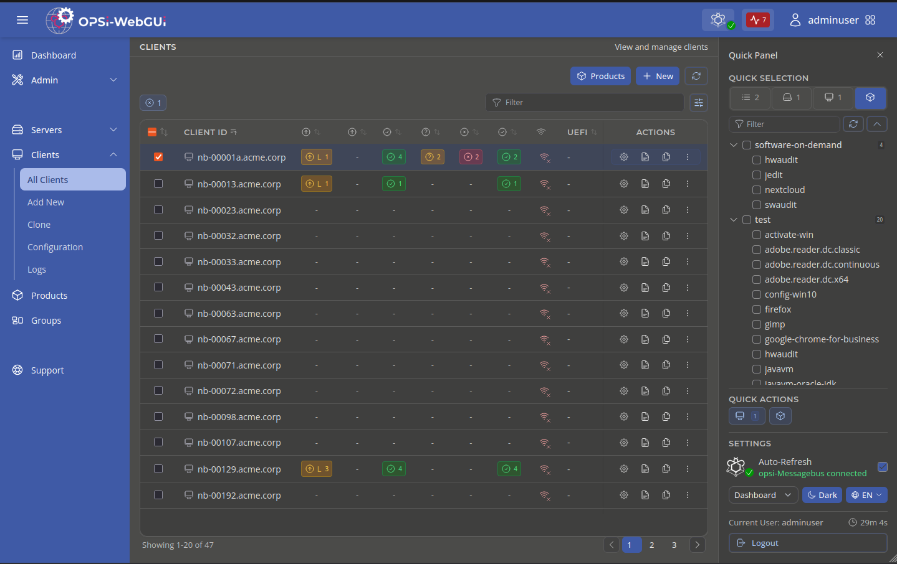

> **Warning:**
>
> ### The default `v4.3-nuxt4` branch is currently under active migration to Nuxt 4. This is a work in progress and not production-ready.
>
> For production use, refer to the `v4.3-nuxt2` branch.

<p align="center">
  <picture>
    <source media="(prefers-color-scheme: dark)" srcset="./frontend/app/assets/images/opsi-webgui-dark.svg">
    <source media="(prefers-color-scheme: light)" srcset="./frontend/app/assets/images/opsi-webgui-light.svg">
    
  </picture>
</p>

<p align="center">
  <a href="https://www.gnu.org/licenses/agpl-3.0">
    
  </a>
  <a href="https://docs.opsi.org/opsi-docs-en/4.3/gui/webgui.html">
    
  </a>
  <a href="https://opsi.org/de/blog/">
    
  </a>
  
</p>

The official web-based management interface for opsi.
Manage clients, deploy software, configure servers, inspect logs and perform administration tasks directly from your browser without installing additional software.



## Install

```bash
sudo apt update && sudo apt install opsi-webgui && sudo systemctl restart opsiconfd
```

Access the webgui at https://<SERVER>:4447/addons/webgui/app.

Or upload [opsi-webgui.zip](https://tools.43.opsi.org/stable/opsi-webgui.zip) via `https://<SERVER>:4447/admin/#addons`.

## Translations

Translations are managed via Transifex: https://app.transifex.com/opsi-org/opsiorg/opsi-webguijson/.
Completed translations are included automatically in future releases.

## Development

Clone this repository and open it in Visual Studio Code with the Remote Containers extension installed.
The development environment will be started automatically in the devcontainer.

## License

[AGPL-3.0](LICENSE) Copyright (c) uib GmbH &lt;info@uib.de&gt;
