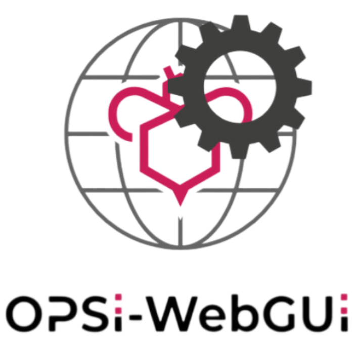
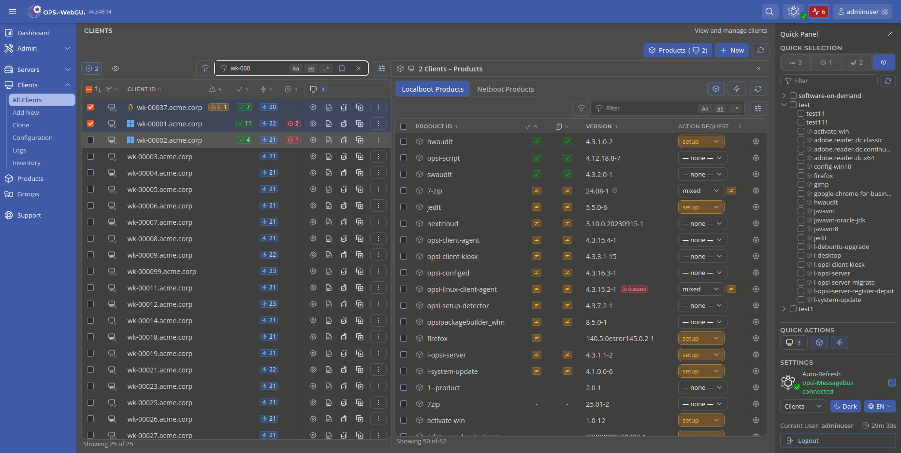

<p align="center">
  <picture>
    <source media="(prefers-color-scheme: dark)" srcset="./frontend/app/assets/images/opsi-webgui-dark.svg">
    <source media="(prefers-color-scheme: light)" srcset="./frontend/app/assets/images/opsi-webgui-light.svg">
    
  </picture>
</p>

<p align="center">
  <a href="https://www.gnu.org/licenses/agpl-3.0">
    
  </a>
  <a href="https://docs.opsi.org/opsi-docs-en/4.3/gui/webgui.html">
    
  </a>
  <a href="https://opsi.org/de/blog/">
    
  </a>
  
  
</p>

**opsi-WebGUI** is the official browser-based management interface for [OPSI](https://www.opsi.org), the open-source client management system.

Manage clients, deploy software, configure servers, inspect logs and perform administration tasks directly from your browser without installing additional software.



## Install

### Package manager

```bash
sudo apt update && sudo apt install opsi-webgui
sudo systemctl restart opsiconfd
```

Access the opsi-WebGUI at `https://<SERVER>:4447/addons/webgui/app`.

### Manual addon upload

Download [opsi-webgui.zip](https://tools.43.opsi.org/stable/opsi-webgui.zip) and upload it via the opsiconfd admin interface at `https://<SERVER>:4447/admin/#addons`.

---

## Development

Clone this repository and open it in Visual Studio Code with the Remote Containers extension installed.
The development environment will be started automatically in the devcontainer.

Devcontainer quick start:

1. Open the repository in VS Code.
2. Reopen in Container.
3. Wait until container initialization has completed.
4. Run all project commands inside the container under `/workspace`.

---

## Testing

The project uses a unified test approach covering:

- Frontend unit tests (Vitest)
  - utility and composable logic
  - security guardrails
  - performance tests for large data components

- Backend integration tests (pytest)
  - API behavior against real backend services
  - security validation

- Frontend E2E tests (Playwright)
  - functional workflows
  - visual regression
  - accessibility validation
  - documentation and marketing screenshots

### Unified E2E Testing (Playwright)

All UI tests use the shared runner: `frontend/tests/e2e/runner/runUITest.ts`.
The runner executes tests in Docker with a real `opsiconfd` backend and test data.

For each page it validates:

1. **Functional behavior**
   - user interactions
   - navigation
   - forms
   - data loading

2. **Visual and accessibility checks**
   - screenshot comparison and baseline updates
   - axe-core scans (WCAG 2.1 AA)

The generated screenshots are used for:

- visual regression
- documentation
- marketing pages

### Test Matrix

|          | Smoke (merge requests) | Full Matrix (nightly/releases) |
| -------- | ---------------------- | ------------------------------ |
| Browser  | Chromium               | Chromium + Firefox             |
| Locale   | DE                     | DE + EN                        |
| Theme    | Light                  | Light + Dark                   |
| Viewport | Desktop                | Desktop + Mobile               |

The full matrix also generates documentation and marketing screenshots, available for download from the CI pipeline artifacts.

### Running Tests Locally

#### Frontend Unit Tests

```bash
cd frontend
pnpm run test:unit
pnpm run test:unit:coverage
```

Security and performance tests:

```bash
pnpm exec vitest run tests/unit/security/
pnpm exec vitest run tests/unit/performance/
```

#### E2E Tests

```bash
scripts/dev-e2e.sh
```

Update visual baselines:

```bash
scripts/dev-e2e.sh -u
```

#### Backend Tests

```bash
cd docker/opsiconfd
uv sync
.venv/bin/python -m pytest /workspace/backend/tests -v
```

---

## Contributing

Contributions are welcome! Please read this section before opening a pull request.

### Workflow

1. Fork the repository on GitHub.
2. Create a feature branch from the default branch
3. Make your changes inside the devcontainer to ensure a consistent environment.
4. Run the relevant tests (see [Testing](#testing)) and make sure they pass.
5. Open a pull request against the default branch with a clear description of the change and the motivation.

### Reporting issues

Please open an issue on [GitHub Issues](https://github.com/opsi-org/opsi-webgui/issues) with:

- opsi-WebGUI version (shown in the bottom-left corner of the login page)
- Steps to reproduce
- Expected vs. actual behavior

### Security vulnerabilities

Do **not** open public issues for security bugs. Report them confidentially to [security@opsi.org](mailto:security@opsi.org).

### Translations

Translations are managed via **Transifex**: https://app.transifex.com/opsi-org/opsiorg/opsi-webguijson/

Completed translations are automatically included in future releases.
If your language is missing or incomplete, contributions via Transifex are very welcome.

---

## License

[AGPL-3.0](LICENSE) Copyright (c) uib GmbH &lt;info@uib.de&gt;
